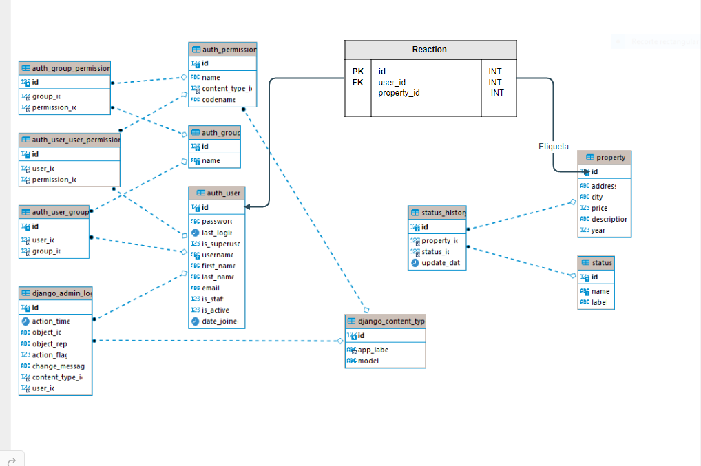

# Api de Inmuebles

## Get Started

Software de terceros
- [Python 3.8](https://www.python.org/downloads/release/python-389/).
- [Flask](https://flask.palletsprojects.com/en/2.0.x/)
-[Flas-mysqldb](https://flask-mysqldb.readthedocs.io/en/latest/)

Para despliegue de proyecto se consideran 3 fases:

1. Desarrollo de API con Flask, conectada a base de datos
    con [Flas-mysqldb](https://flask-mysqldb.readthedocs.io/en/latest/)
3. Actualización de modelo de base de datos.


## Prerequisitos

- Instala [Python 3.8](https://www.python.org/downloads/release/python-389/)

Para pruebas locales, habilita el entorno virtual de Python e instala las librerías del proyecto.

```commandline
git clone https://github.com/jcamilofarfan/api-inmuebles.git
cd api-inmuebles
python -m venv venv
source venv/bin/activate
pip install -r requirements.txt
```

## Prueba de API
```
python App.py
```

## Segunda Fase

Se propone un modelo de base de datos como el que se indica a
continuación:



Donde se agrega una nueva tabla con los siguientes campos:
    - id: identificador único de la reaccion
    - id del usuario que realiza la reaccion
    - id del inmueble que se reacciona
Donde se tendra el historico de las reacciones realizadas por cada usuario y si un usuario quita la reaccion de un inmueble se  elimina la reaccion.